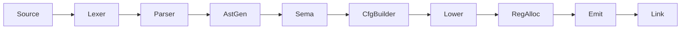

# CLAUDE.md

This file provides guidance to Claude Code (claude.ai/code) when working with code in this repository.

**Note**: This project uses [bd (beads)](https://github.com/steveyegge/beads) for issue tracking. Use `bd` commands instead of markdown TODOs. See the Issue Tracking section below for workflow details.

## Project Overview

Rue is a systems programming language aiming for memory safety without garbage collection, with higher-level ergonomics than Rust/Zig. Currently in early development with Rust-like syntax.

## Build System

This project uses Buck2 (via `./buck2` wrapper script), not Cargo.

### Common Commands

```bash
# Build the compiler
./buck2 build //crates/rue:rue

# Build everything
./buck2 build //...

# Run all tests (unit + spec)
./test.sh

# Run unit tests only
./buck2 test //...

# Run spec tests only
./buck2 run //crates/rue-spec:rue-spec

# Run a specific crate's tests
./buck2 test //crates/rue-lexer:rue-lexer-test

# Filter spec tests by pattern
./buck2 run //crates/rue-spec:rue-spec -- "1.1"  # Section 1.1
./buck2 run //crates/rue-spec:rue-spec -- "zero" # Tests matching "zero"

# Compile and run a program
./buck2 run //crates/rue:rue -- source.rue output
./output

# Emit intermediate representations (can specify multiple stages)
./buck2 run //crates/rue:rue -- --emit tokens source.rue  # Lexer tokens
./buck2 run //crates/rue:rue -- --emit ast source.rue     # Abstract syntax tree
./buck2 run //crates/rue:rue -- --emit rir source.rue     # Untyped IR
./buck2 run //crates/rue:rue -- --emit air source.rue     # Typed IR
./buck2 run //crates/rue:rue -- --emit cfg source.rue     # Control flow graph
./buck2 run //crates/rue:rue -- --emit mir source.rue     # Machine IR (virtual registers)
./buck2 run //crates/rue:rue -- --emit asm source.rue     # Assembly (physical registers)

# Chain multiple stages to see the full pipeline
./buck2 run //crates/rue:rue -- --emit tokens --emit ast --emit rir source.rue
```

## Architecture

The compiler pipeline transforms source through successive IRs:



| Stage | Pass | IR Produced | `--emit` flag |
|-------|------|-------------|---------------|
| 1 | Lexer | tokens | `tokens` |
| 2 | Parser | AST | `ast` |
| 3 | AstGen | RIR (untyped) | `rir` |
| 4 | Sema | AIR (typed) | `air` |
| 5 | CfgBuilder | CFG | `cfg` |
| 6 | Lower | MIR (machine) | `mir` |
| 7 | RegAlloc | MIR (allocated) | `asm` |
| 8 | Emit | bytes | - |
| 9 | Link | ELF | - |

### Crate Responsibilities

| Crate | Purpose |
|-------|---------|
| `rue` | CLI binary |
| `rue-compiler` | Pipeline orchestration |
| `rue-lexer` | Tokenization |
| `rue-parser` | AST construction |
| `rue-rir` | Untyped IR (post-parse, pre-typing) |
| `rue-air` | Typed IR (after semantic analysis) |
| `rue-codegen` | x86-64 machine code generation |
| `rue-linker` | ELF object file creation and linking |
| `rue-error` | Error types |
| `rue-span` | Source location tracking |
| `rue-intern` | String interning |
| `rue-spec` | Specification test runner |
| `rue-runtime` | Runtime support |

### Key Design Decisions

- **Architecture-specific MIR**: Each target gets its own machine IR (currently X86Mir), following Zig's approach
- **Index-based references**: Instructions stored in vectors, referenced by u32 indices (cache-friendly, no lifetimes)
- **Direct code emission**: No LLVM dependency; machine code emitted directly
- **Minimal ELF**: Static executables with direct syscalls (Linux x86-64 only)

## Testing

### Unit Tests
Add to relevant crate's source file with `#[cfg(test)]` modules. Ensure crate has `rust_test` target in its `BUCK` file.

### UI Tests

UI tests verify compiler behavior that is **not** part of the language specification, such as:
- Warning messages (unused variables, unreachable code)
- Diagnostic quality and formatting
- Compiler flags and options
- Error message wording

#### UI Test Directory Structure

UI tests are in `crates/rue-ui-tests/cases/`:

```
cases/
├── warnings/         # Warning detection tests
│   ├── unused.toml   # Unused variable/function warnings
│   └── unreachable.toml  # Unreachable code warnings
└── diagnostics/      # Error message quality tests (future)
```

#### UI Test Format

```toml
[section]
id = "warnings.unused"
name = "Unused Variable Warnings"
description = "Tests for detection of unused variables."

[[case]]
name = "unused_variable_warning"
source = """
fn main() -> i32 {
    let x = 42;
    0
}
"""
exit_code = 0
warning_contains = ["unused variable", "'x'"]
expected_warning_count = 1

[[case]]
name = "no_warnings_expected"
source = """
fn main() -> i32 {
    let x = 42;
    x
}
"""
exit_code = 42
no_warnings = true
```

#### Running UI Tests

```bash
# Run all UI tests
./buck2 run //crates/rue-ui-tests:rue-ui-tests

# Filter by pattern
./buck2 run //crates/rue-ui-tests:rue-ui-tests -- "unused"
```

#### When to Add UI Tests vs Spec Tests

- **Spec tests** (`crates/rue-spec/cases/`): Language semantics defined in the specification. These tests have `spec = [...]` references linking to spec paragraphs.
- **UI tests** (`crates/rue-ui-tests/cases/`): Compiler quality-of-life features not in the spec (warnings, diagnostics, CLI behavior).

### Specification Tests

The specification test system provides traceability between the language specification and tests.

#### Test Directory Structure

Tests are organized in `crates/rue-spec/cases/` by language feature:

```
cases/
├── lexical/          # Tokens, comments, whitespace
├── types/            # Integer, boolean, unit, never types
├── expressions/      # Literals, operators, control flow
├── statements/       # Let, assignment, expression statements
├── items/            # Functions, structs
├── arrays/           # Fixed-size arrays
├── runtime/          # Intrinsics, runtime behavior
├── golden/           # IR dump tests
└── errors/           # Compile-time error tests
```

#### Test Format

```toml
[section]
id = "expressions.arithmetic"
spec_chapter = "4.2"           # Links to spec chapter
name = "Arithmetic Operators"

# Run-pass test with spec traceability
[[case]]
name = "addition_basic"
spec = ["4.2:1", "4.2:2"]      # Spec paragraphs this test covers
source = "fn main() -> i32 { 1 + 2 }"
exit_code = 3

# Compile-fail test
[[case]]
name = "type_mismatch"
spec = ["4.2:5"]
source = "fn main() -> i32 { 1 + true }"
compile_fail = true
error_contains = "type mismatch"

# Golden test (exact IR output)
[[case]]
name = "simple_add_air"
spec = ["4.2:1"]
source = "fn main() -> i32 { 42 }"
expected_air = """
function main:
air (return_type: i32) {
    %0 : i32 = const 42
    %1 : i32 = ret %0
}
"""
```

#### Spec Paragraph References

The `spec` field links tests to specification paragraphs using the format `{chapter}.{section}:{paragraph}`:
- `3.1:1` - Chapter 3, Section 1, Paragraph 1
- `4.2:5` - Chapter 4, Section 2, Paragraph 5

### Language Specification

The formal language specification is in `docs/spec/src/`. It is integrated into the website via Zola.

#### Building the Spec

The spec is built as part of the website:

```bash
./website/build.sh
# Output in website/public/spec/
```

#### Spec Structure

```
docs/spec/src/
├── _index.md               # Spec root (Zola section)
├── 01-introduction.md      # Conformance, definitions
├── 02-lexical-structure/   # Tokens, comments, keywords
├── 03-types/               # Type system
├── 04-expressions/         # All expression forms
├── 05-statements/          # Statement forms
├── 06-items/               # Functions, structs
├── 07-arrays/              # Array types
├── 08-runtime-behavior/    # Overflow, bounds checking
└── appendices/             # Grammar, UB summary
```

#### Spec Paragraph Format

Each paragraph has an ID using the Zola shortcode format `{{ rule(id="X.Y:Z", cat="category") }}`:

```markdown
{{ rule(id="3.1:1", cat="normative") }}
A signed integer type is one of: `i8`, `i16`, `i32`, or `i64`.

{{ rule(id="3.1:2", cat="normative") }}
Signed integer arithmetic that overflows causes a runtime panic.

{{ rule(id="3.1:3", cat="example") }}
```rue
let x: i32 = 42;
```
```

The format is `{{ rule(id="X.Y:Z") }}` or `{{ rule(id="X.Y:Z", cat="category") }}` where:
- `X.Y` is the chapter and section (e.g., `3.1` for Chapter 3, Section 1)
- `Z` is the paragraph number within that section
- The colon (`:`) separates the structural location from the paragraph number
- `cat` is optional (defaults to `informative` if omitted)

**Paragraph categories:**
- `normative` - General normative rule (requires test coverage)
- `legality-rule` - Compile-time requirements (normative)
- `dynamic-semantics` - Runtime behavior (normative)
- `syntax` - Grammar rules (normative)
- `undefined-behavior` - UB conditions (normative)
- `example` - Code examples (informative)
- `informative` - Explanatory text (informative, default)

#### Traceability Report

Generate a report showing test coverage of spec paragraphs:

```bash
# Summary report
./buck2 run //crates/rue-spec:rue-spec -- --traceability

# Detailed matrix (shows all paragraphs and their covering tests)
./buck2 run //crates/rue-spec:rue-spec -- --traceability --detailed
```

The traceability check is run as part of `./test.sh` and fails if:
- Any spec paragraph has no covering test (coverage < 100%)
- Any test references a non-existent spec paragraph ID

## Modifying the Language

When adding or changing language features, follow this checklist:

### Implementation Steps

1. **Update the specification** (`docs/spec/src/`)
   - Add/modify spec paragraphs with proper IDs (e.g., `r[4.2:3#normative]`)
   - Include normative rules, dynamic semantics, and examples
   - Update the grammar appendix if syntax changes

2. **Update `rue-lexer`** if new tokens needed

3. **Update `rue-parser`** for new syntax

4. **Update `rue-rir`** for new IR instructions

5. **Update `rue-air`** for typed versions

6. **Update `rue-codegen`** for code generation

7. **Add spec tests** in `crates/rue-spec/cases/`
   - Include `spec = ["X.Y:Z"]` references to link to spec paragraphs
   - Cover all normative paragraphs (traceability check enforces 100% coverage)

8. **Add UI tests** in `crates/rue-ui-tests/cases/` if the feature includes:
   - New warnings or lints
   - Changes to error message formatting
   - New compiler flags or options

9. **Run `./test.sh`** to verify all tests pass and traceability is maintained

## Codegen: Multi-Backend Considerations

**IMPORTANT**: The `rue-codegen` crate contains multiple architecture backends:
- `x86_64/` - Linux x86-64
- `aarch64/` - macOS ARM64

When making changes to codegen, **always check if the same change is needed in all backends**. Common areas that require parallel changes:

- **New MIR instructions**: Add to both `x86_64/mir.rs` and `aarch64/mir.rs`
- **Instruction emission**: Update both `x86_64/emit.rs` and `aarch64/emit.rs`
- **Register allocation**: Update both `x86_64/regalloc.rs` and `aarch64/regalloc.rs`
- **Liveness analysis**: Update both `x86_64/liveness.rs` and `aarch64/liveness.rs`
- **CFG lowering**: Update both `x86_64/cfg_lower.rs` and `aarch64/cfg_lower.rs`

Example: If adding a new comparison instruction variant (e.g., 64-bit compare):
1. Add `Cmp64RR` to both MIR definitions
2. Add emission logic to both emitters
3. Add register allocation handling to both allocators
4. Add liveness tracking to both liveness analyzers
5. Update CFG lowering in both backends to use the new instruction where appropriate

**Testing across backends**: The spec tests run on the host architecture only. If you only have access to one platform, note in your commit message that the other backend may need verification.

## Version Control

Uses Jujutsu (jj): `jj status`, `jj diff`, `jj commit -m "msg"`, `jj log`

## Code Style

- Standard Rust formatting (rustfmt)
- Rust edition 2024

## Issue Tracking with bd (beads)

**IMPORTANT**: This project uses **bd (beads)** for ALL issue tracking. Do NOT use markdown TODOs, task lists, or other tracking methods.

### Why bd?

- Dependency-aware: Track blockers and relationships between issues
- VCS-friendly: Auto-syncs to JSONL for version control
- Agent-optimized: JSON output, ready work detection, discovered-from links
- Prevents duplicate tracking systems and confusion

### Quick Start

```bash
# Find ready work
bd ready --json

# Create new issues
bd create "Issue title" -t bug|feature|task -p 0-4 --json
bd create "Issue title" -p 1 --deps discovered-from:bd-123 --json
bd create "Subtask" --parent <epic-id> --json  # Hierarchical subtask

# Claim and update
bd update bd-42 --status in_progress --json

# Complete work
bd close bd-42 --reason "Completed" --json
```

### Issue Types

- `bug` - Something broken
- `feature` - New functionality
- `task` - Work item (tests, docs, refactoring)
- `epic` - Large feature with subtasks
- `chore` - Maintenance (dependencies, tooling)

### Priorities

- `0` - Critical (security, data loss, broken builds)
- `1` - High (major features, important bugs)
- `2` - Medium (default, nice-to-have)
- `3` - Low (polish, optimization)
- `4` - Backlog (future ideas)

### Workflow for AI Agents

1. **Check ready work**: `bd ready` shows unblocked issues
2. **Claim your task**: `bd update <id> --status in_progress`
3. **Work on it**: Implement, test, document
4. **Discover new work?** Create linked issue:
   - `bd create "Found bug" -p 1 --deps discovered-from:<parent-id>`
5. **Complete**: `bd close <id> --reason "Done"`
6. **Commit together**: Always commit the `.beads/issues.jsonl` file together with the code changes so issue state stays in sync with code state

### Auto-Sync

bd automatically syncs with version control:
- Exports to `.beads/issues.jsonl` after changes (5s debounce)
- Imports from JSONL when newer (e.g., after pulling changes)
- No manual export/import needed!

### CLI Help

Run `bd <command> --help` to see all available flags for any command.

### Important Rules

- ✅ Use bd for ALL task tracking
- ✅ Always use `--json` flag for programmatic use
- ✅ Link discovered work with `discovered-from` dependencies
- ✅ Check `bd ready` before asking "what should I work on?"
- ✅ Run `bd <cmd> --help` to discover available flags
- ❌ Do NOT create markdown TODO lists
- ❌ Do NOT use external issue trackers
- ❌ Do NOT duplicate tracking systems
