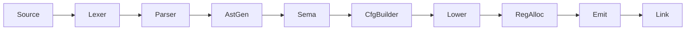

# CLAUDE.md

This file provides guidance to Claude Code (claude.ai/code) when working with code in this repository.

**Note**: This project uses [bd (beads)](https://github.com/steveyegge/beads) for issue tracking. Use `bd` commands instead of markdown TODOs. See the Issue Tracking section below for workflow details.

## Project Overview

Rue is a systems programming language aiming for memory safety without garbage collection, with higher-level ergonomics than Rust/Zig. Currently in early development with Rust-like syntax.

## Build System

This project uses Buck2 (via `./buck2` wrapper script), not Cargo.

You will need to source `~/.profile` before running any commands.

### Common Commands

```bash
# Build the compiler
./buck2 build //crates/rue:rue

# Build everything
./buck2 build //...

# Run all tests (unit + spec)
./test.sh

# Run unit tests only
./buck2 test //...

# Run spec tests only
./buck2 run //crates/rue-spec:rue-spec

# Run a specific crate's tests
./buck2 test //crates/rue-lexer:rue-lexer-test

# Filter spec tests by pattern
./buck2 run //crates/rue-spec:rue-spec -- "1.1"  # Section 1.1
./buck2 run //crates/rue-spec:rue-spec -- "zero" # Tests matching "zero"

# Compile and run a program
./buck2 run //crates/rue:rue -- source.rue output
./output

# Emit intermediate representations (can specify multiple stages)
./buck2 run //crates/rue:rue -- --emit tokens source.rue  # Lexer tokens
./buck2 run //crates/rue:rue -- --emit ast source.rue     # Abstract syntax tree
./buck2 run //crates/rue:rue -- --emit rir source.rue     # Untyped IR
./buck2 run //crates/rue:rue -- --emit air source.rue     # Typed IR
./buck2 run //crates/rue:rue -- --emit cfg source.rue     # Control flow graph
./buck2 run //crates/rue:rue -- --emit mir source.rue     # Machine IR (virtual registers)
./buck2 run //crates/rue:rue -- --emit asm source.rue     # Assembly (physical registers)

# Chain multiple stages to see the full pipeline
./buck2 run //crates/rue:rue -- --emit tokens --emit ast --emit rir source.rue
```

## Architecture

The compiler pipeline transforms source through successive IRs:



| Stage | Pass | IR Produced | `--emit` flag |
|-------|------|-------------|---------------|
| 1 | Lexer | tokens | `tokens` |
| 2 | Parser | AST | `ast` |
| 3 | AstGen | RIR (untyped) | `rir` |
| 4 | Sema | AIR (typed) | `air` |
| 5 | CfgBuilder | CFG | `cfg` |
| 6 | Lower | MIR (machine) | `mir` |
| 7 | RegAlloc | MIR (allocated) | `asm` |
| 8 | Emit | bytes | - |
| 9 | Link | ELF | - |

### Crate Responsibilities

| Crate | Purpose |
|-------|---------|
| `rue` | CLI binary |
| `rue-compiler` | Pipeline orchestration |
| `rue-lexer` | Tokenization |
| `rue-parser` | AST construction |
| `rue-rir` | Untyped IR (post-parse, pre-typing) |
| `rue-air` | Typed IR (after semantic analysis) |
| `rue-codegen` | x86-64 machine code generation |
| `rue-linker` | ELF object file creation and linking |
| `rue-error` | Error types |
| `rue-span` | Source location tracking |
| `rue-intern` | String interning |
| `rue-spec` | Specification test runner |
| `rue-runtime` | Runtime support |

### Key Design Decisions

- **Architecture-specific MIR**: Each target gets its own machine IR (currently X86Mir), following Zig's approach
- **Index-based references**: Instructions stored in vectors, referenced by u32 indices (cache-friendly, no lifetimes)
- **Direct code emission**: No LLVM dependency; machine code emitted directly
- **Minimal ELF**: Static executables with direct syscalls (Linux x86-64 only)

## Testing

### Unit Tests
Add to relevant crate's source file with `#[cfg(test)]` modules. Ensure crate has `rust_test` target in its `BUCK` file.

### Specification Tests
Add test cases to `.toml` files in `crates/rue-spec/cases/`:

```toml
# Run-pass test
[[case]]
name = "my_test"
source = "fn main() -> i32 { 42 }"
exit_code = 42

# Compile-fail test
[[case]]
name = "my_error_test"
source = "fn main() { }"
compile_fail = true
error_contains = "expected '->'"

# Golden test (exact IR output)
[[case]]
name = "my_golden_test"
source = "fn main() -> i32 { 42 }"
expected_air = """
function main:
air (return_type: i32) {
    %0 : i32 = const 42
    %1 : i32 = ret %0
}
"""
```

## Modifying the Grammar

1. Update `rue-lexer` if new tokens needed
2. Update `rue-parser` for new syntax
3. Update `rue-rir` for new IR instructions
4. Update `rue-air` for typed versions
5. Update `rue-codegen` for code generation
6. Add spec tests in `crates/rue-spec/cases/`

## Version Control

Uses Jujutsu (jj): `jj status`, `jj diff`, `jj commit -m "msg"`, `jj log`

## Code Style

- Standard Rust formatting (rustfmt)
- Rust edition 2024

## Issue Tracking with bd (beads)

**IMPORTANT**: This project uses **bd (beads)** for ALL issue tracking. Do NOT use markdown TODOs, task lists, or other tracking methods.

### Why bd?

- Dependency-aware: Track blockers and relationships between issues
- VCS-friendly: Auto-syncs to JSONL for version control
- Agent-optimized: JSON output, ready work detection, discovered-from links
- Prevents duplicate tracking systems and confusion

### Quick Start

```bash
# Find ready work
bd ready --json

# Create new issues
bd create "Issue title" -t bug|feature|task -p 0-4 --json
bd create "Issue title" -p 1 --deps discovered-from:bd-123 --json
bd create "Subtask" --parent <epic-id> --json  # Hierarchical subtask

# Claim and update
bd update bd-42 --status in_progress --json

# Complete work
bd close bd-42 --reason "Completed" --json
```

### Issue Types

- `bug` - Something broken
- `feature` - New functionality
- `task` - Work item (tests, docs, refactoring)
- `epic` - Large feature with subtasks
- `chore` - Maintenance (dependencies, tooling)

### Priorities

- `0` - Critical (security, data loss, broken builds)
- `1` - High (major features, important bugs)
- `2` - Medium (default, nice-to-have)
- `3` - Low (polish, optimization)
- `4` - Backlog (future ideas)

### Workflow for AI Agents

1. **Check ready work**: `bd ready` shows unblocked issues
2. **Claim your task**: `bd update <id> --status in_progress`
3. **Work on it**: Implement, test, document
4. **Discover new work?** Create linked issue:
   - `bd create "Found bug" -p 1 --deps discovered-from:<parent-id>`
5. **Complete**: `bd close <id> --reason "Done"`
6. **Commit together**: Always commit the `.beads/issues.jsonl` file together with the code changes so issue state stays in sync with code state

### Auto-Sync

bd automatically syncs with version control:
- Exports to `.beads/issues.jsonl` after changes (5s debounce)
- Imports from JSONL when newer (e.g., after pulling changes)
- No manual export/import needed!

### CLI Help

Run `bd <command> --help` to see all available flags for any command.

### Important Rules

- ✅ Use bd for ALL task tracking
- ✅ Always use `--json` flag for programmatic use
- ✅ Link discovered work with `discovered-from` dependencies
- ✅ Check `bd ready` before asking "what should I work on?"
- ✅ Run `bd <cmd> --help` to discover available flags
- ❌ Do NOT create markdown TODO lists
- ❌ Do NOT use external issue trackers
- ❌ Do NOT duplicate tracking systems
